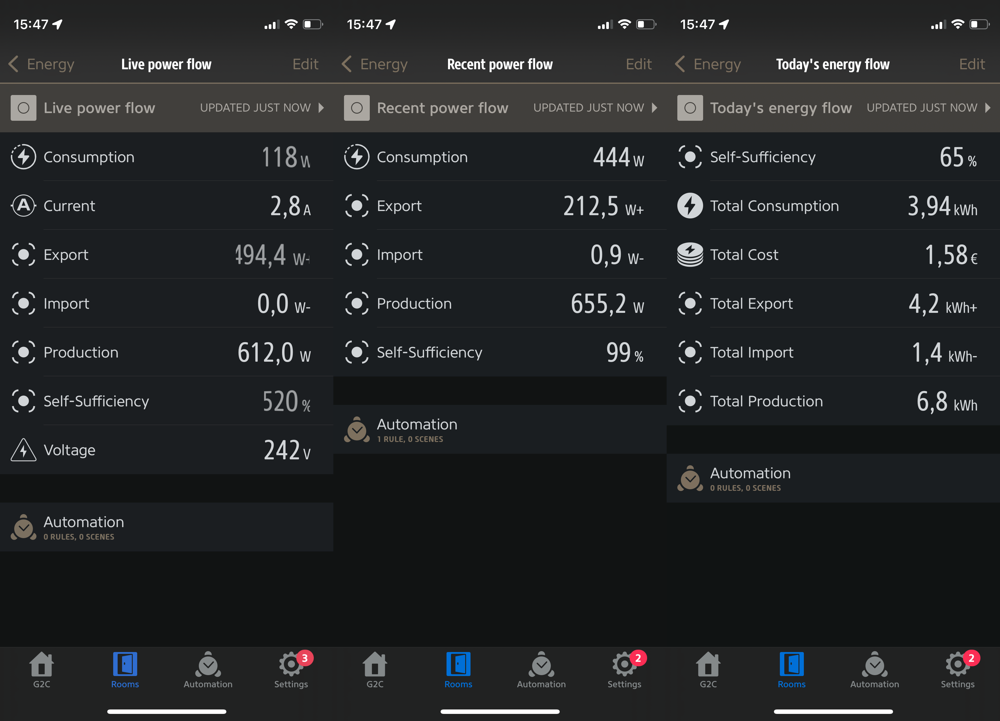
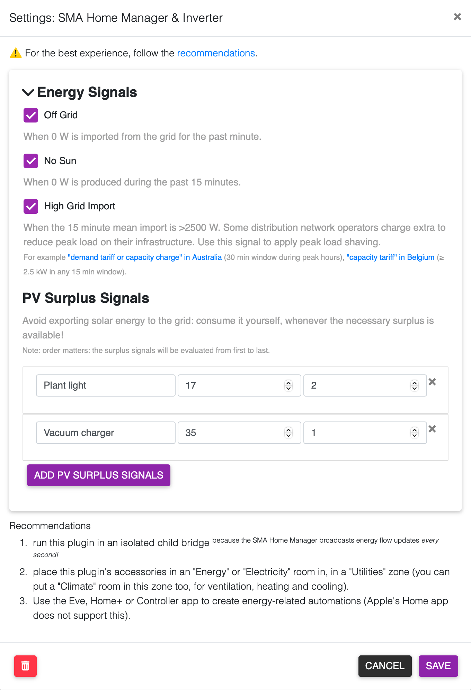
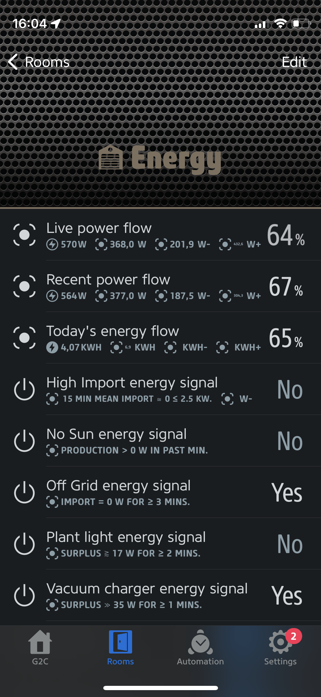

  

  

# homebridge-sma-home-manager

Homebridge plugin to:

1. integrate your home with an **[SMA inverter](https://www.sma.de/en/products/solar-inverters)**: observe live power (`W`, `V`, `A`), today's production (`kWh`) and device status/health using [ModBus](https://files.sma.de/downloads/SMA-Modbus-general-TI-en-10.pdf) (and firmware version & serial number)
2. integrate your home with the **[SMA Home Manager](https://www.sma.de/en/products/monitoring-control/sunny-home-manager)**: observe live power consumed (`W`) and today's consumption (`kWh`) using [Speedwire](https://developer.sma.de/fileadmin/content/global/Partner/Documents/SMA_Labs/EMETER-Protokoll-TI-en-10.pdf) (and firmware version & serial number)
3. combine this data to compute the following custom [characteristics](https://developer.apple.com/documentation/homekit/hmcharacteristic/characteristic_types):  
    - **Consumption**
    - **Production**
    - **Import** (from grid, i.e. consumption not produced)
    - **Export** (to grid, i.e. production not consumed)
    - **Self-sufficiency level** (-100% if no production, 0–99% if some production, 100–1000% if production and no import)
4. add 3 new accessories to your home:  
    - **Live power flow**: live view in `W` of the above, updated every second
    - **Recent power flow**: average of last 3 minutes in `W`, updated every second
    - **Today's energy flow**: view of today in `kWh`, updated every minute
    

    
    

4. optionally, add **energy signals** an additional accessory per energy signal:
    - **Off grid**: 0 W is imported from the grid for the past minute
    - **No sun**: 0 W is produced during the past 15 minutes
    - **High Grid Import**: 15 minute mean import is >2500 W.  
      Some distribution network operators charge extra to reduce peak load on their infrastructure. Use this signal to apply peak load shaving. For example <a href="https://www.energyaustralia.com.au/home/electricity-and-gas/compare-electricity-and-gas-plans/tariffs">"demand tariff or capacity charge" in Australia</a> (30 min window during peak hours), <a href="https://www.fluvius.be/nl/thema/factuur-en-tarieven/capaciteitstarief/gezinnen-en-kleine-ondernemingen/wat-is-het">"capacity tariff" in Belgium</a> (≥ 2.5 kW in any 15 min window).
5. optionally, add _configurable_ **PV surplus signals** as additional accessories:
    - enter a _label_
    - enter a number of _Watts_
    - enter a number of _minutes_.
    - … then that configured PV surplus signal's accessory will be toggled on when there has been surplus production (i.e. export) of the entered _Watts_ for the entered _minutes_, with some margin to cover base load variability (to avoid frequent toggling)
    

    
    

All _energy signals_ have an `On`/`Off` status with a _Reason_ to make it easy to understand _why_ this energy signal is on or off.

## Requirements

- [SMA inverter](https://www.sma.de/en/products/solar-inverters) with the ModBus setting enabled (it's off by default)
- [SMA Home Manager 2.0](https://www.sma.de/en/products/monitoring-control/sunny-home-manager)

**All 100% local, no internet access needed.**

## Credit

This was forked from <https://github.com/codyc1515/homebridge-sma-inverter>. Differences:

- Omitted the Eve-based history support which didn't quite work. Recommended alternative: [`sbfspot`](https://github.com/SBFspot/SBFspot) [`Docker` image](https://github.com/nakla/sbfspot) (which reads data locally, also via ModBus), and optionally upload let it upload your production data to <https://pvoutput.org> (easy to use UI)
- Omitted the "Total". Observe that in SMA's `SMA Energy` app.
- Stopped exposing the inverter's information as light sensors (pseudo-live, today, total).
- Removed inverter IP address configuration in favor of [zero config thanks to a link-local address](https://manuals.sma.de/SBSxx-10/en-US/1685190283.html) instead.
- Many bugfixes.
- Added support for SMA Home Manager, also using [zero config thanks to SMA Speedwire](https://www.iana.org/assignments/service-names-port-numbers/service-names-port-numbers.xhtml?search=sma-spw)
- Added combined view of inverter & Home Manager's data.
- Added energy signals.